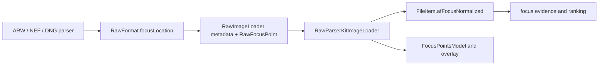

+++
author = "Thomas Evensen"
title = "Sony, Nikon, and DNG Metadata Parsers"
date = "2026-08-21"
lastmod = "2026-09-15"
tags = ["focus points", "sony", "nikon", "dng", "arw", "nef", "parser"]
categories = ["technical details"]
mermaid = true
+++

# Sony, Nikon, and DNG Metadata Parsers

RawParserKit `1.3.0`, revision
`d2175ed880d39021bdb5f5a2a842b460af0b316c`, provides one neutral result
shape for Sony ARW, Nikon NEF, and Adobe DNG autofocus metadata. RawCull enters
through `RawImageLoader.metadata(for:)` or `RawFormatRegistry`; diagnostics and
package tests may call a format parser directly.

## Current Source Map

| Area | RawParserKit file |
|---|---|
| Neutral format contract and registration | `Sources/RawParserKit/RawFormat.swift`, `RawFormatRegistry.swift` |
| Normalized focus value and metadata snapshot | `Sources/RawParserKit/BrowserFocusPoint.swift`, `BrowserExifInfo.swift` |
| Facade and EXIF fallback | `Sources/RawParserKit/RawImageLoader.swift` |
| Sony | `SonyMakerNoteParser.swift`, `SonyRawFormat.swift`, `SonyThumbnailExtractor.swift`, `SonyEmbeddedJPEGExtractor` |
| Nikon | `NikonMakerNoteParser.swift`, `NikonRawFormat.swift`, `NikonThumbnailExtractor.swift`, `NikonEmbeddedJPEGExtractor` |
| DNG | `DNGMakerNoteParser.swift`, `DNGRawFormat.swift`, `DNGThumbnailExtractor.swift`, `DNEmbeddedJPEGExtractor.swift` |
| RawCull consumer | `RawCull/Model/RawImageLoading.swift`, `RawCull/Actors/ScanFiles.swift` |

`RawFormatRegistry.all` registers `SonyRawFormat` for `.arw`, `NikonRawFormat`
for `.nef`, and `DNGRawFormat` for `.dng`. Each conformer supplies focus-point
parsing, thumbnail and embedded-preview extraction, compression labels, and RAW
size thresholds.

## Shared Focus Contract

All three parser paths return:

```text
imageWidth imageHeight focusX focusY
```

`RawFocusPoint` validates four numbers, positive dimensions, and normalized
coordinates in `0...1`. The RawCull adapter converts that value to `CGPoint` for
`FileItem.afFocusNormalized` while retaining the four-number compatibility
string for the focus overlay.


```mermaid
flowchart LR
    Parser["ARW / NEF / DNG parser"] --> Format["RawFormat.focusLocation"]
    Format --> Meta["RawImageLoader metadata + RawFocusPoint"]
    Meta --> Adapter["RawParserKitImageLoader"]
    Adapter --> Item["FileItem.afFocusNormalized"]
    Adapter --> Overlay["FocusPointsModel and overlay"]
    Item --> Analysis["focus evidence and ranking"]
```

For example, `"6000 4000 3000 2000"` normalizes to `(0.5, 0.5)`. A Nikon
AFInfo2 value such as `"8256 5504 2064 1376"` normalizes to `(0.25, 0.25)`.
The examples describe the contract; package tests use synthetic TIFF/MakerNote
structures rather than camera files.

## Fallback Order

`RawImageLoader.metadata(for:)` asks the registered format for a focus location
first. If none is produced, it reads `kCGImagePropertyExifSubjectArea`, treats
the first two numbers as pixel X/Y, and normalizes them against image width and
height. Invalid dimensions or out-of-range values produce no point.

RawCull then has a catalog-wide compatibility fallback: `ScanFiles` reads
`focuspoints.json` only when the entire native-point collection is empty. If
even one file has a native MakerNote or EXIF point, JSON is not merged into the
partly populated result. JSON supplies overlay compatibility data; it does not
retroactively populate every `FileItem.afFocusNormalized`.

## Format-Specific Parsing

- Sony follows TIFF IFD0 to EXIF and the Sony MakerNote IFD, including
  FocusLocation `0x2027`, and reports embedded JPEG candidates.
- Nikon validates the Type-3 MakerNote and reads supported AFInfo2 `0x00B7`
  layouts. Unsupported layouts return `nil`.
- DNG walks TIFF IFD0 and SubIFDs. Standards-classified files use
  `NewSubFileType` plus `Compression` to distinguish thumbnails/previews from
  JPEG-compressed raw strips. Files without `NewSubFileType` retain a positional
  fallback. DNG compression labels include uncompressed, JPEG, Deflate,
  PackBits, Lossy DNG, and JPEG XL.

The DNG container is camera-neutral, so its size classes use generic megapixel
thresholds with overrides for known high-resolution, full-frame, and smaller
sensor camera families.

## Tests At The Pinned Revision

| Test | Contract |
|---|---|
| `SonyMakerNoteParserTests.swift` | Sony focus tags, offsets, malformed input, and embedded JPEG discovery |
| `NikonMakerNoteParserTests.swift` | Nikon Type-3/AFInfo2 layouts, byte order, and embedded JPEG discovery |
| `DNGMakerNoteParserTests.swift` | DNG TIFF/SubIFD focus and preview discovery, including malformed data |
| `DNGRawFormatTests.swift` | DNG compression labels, size classes, and format behavior |
| `RawFormatRegistryTests.swift` | Case-insensitive ARW/NEF/DNG dispatch and unregistered formats |

## Checklist For Another RAW Format

1. Add a stateless `RawFormat` conformer with extensions, display name,
   extraction, focus location, compression labels, and size thresholds.
2. Register it in `RawFormatRegistry.all`; keep app code on the registry and
   `RawImageLoader` facade.
3. Normalize autofocus output to `"width height x y"` and prove bounds,
   endianness, truncation, missing tags, and unsupported versions are safe.
4. Add synthetic parser, registry, metadata-fallback, preview, orientation,
   cancellation, and diagnostics tests.
5. Verify the RawCull adapter maps the result into the same visual coordinate
   system and preserves the catalog-wide JSON fallback rule.
