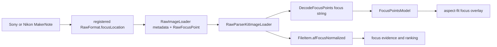

+++
author = "Thomas Evensen"
title = "Sony/Nikon MakerNote Parser"
date = "2026-08-21"
tags = ["focus points", "sony", "nikon", "arw", "nef", "parser"]
categories = ["technical details"]
mermaid = true
+++

# Sony/Nikon MakerNote Parser

RawParserKit `1.2.8` provides one vendor-neutral result shape for Sony ARW and
Nikon NEF autofocus metadata. RawCull normally enters through
`RawImageLoader.metadata(for:)` or `RawFormatRegistry`; only diagnostics and
package tests should call a vendor parser directly.

## Current Source Map

| Area | RawParserKit file |
|---|---|
| Neutral format contract and registration | `Sources/RawParserKit/RawFormat.swift`, `RawFormatRegistry.swift` |
| Normalized focus value and metadata snapshot | `Sources/RawParserKit/BrowserFocusPoint.swift` (`RawFocusPoint`), `BrowserExifInfo.swift` (`RawImageMetadata`) |
| Facade and EXIF fallback | `Sources/RawParserKit/RawImageLoader.swift` |
| Sony implementation | `Sources/RawParserKit/SonyMakerNoteParser.swift`, `SonyRawFormat.swift`, `SonyThumbnailExtractor.swift`, `JPGSonyARWExtractor.swift` |
| Nikon implementation | `Sources/RawParserKit/NikonMakerNoteParser.swift`, `NikonRawFormat.swift`, `NikonThumbnailExtractor.swift`, `JPGNikonNEFExtractor.swift` |
| Parser diagnostics | `Sources/RawParserKit/RawParserDiagnostics.swift` |
| RawCull adapter and consumer | `RawCull/Model/RawImageLoading.swift`, `RawCull/Actors/ScanFiles.swift`, `RawCull/Model/ViewModels/RawCullViewModel+Catalog.swift` |

`RawFormatRegistry.all` registers only `SonyRawFormat` for `.arw` and
`NikonRawFormat` for `.nef`. Each conformer supplies focus-location parsing,
thumbnail and embedded-preview extraction, compression labels, and RAW size
thresholds.

## One Shared Focus Contract

Both MakerNote parsers expose:

```text
imageWidth imageHeight focusX focusY
```

`RawFocusPoint` validates four numbers, positive dimensions, and normalized
coordinates in `0...1`, then stores `normalizedX` and `normalizedY`. The RawCull
adapter converts that value to `CGPoint`, while reconstructing the four-number
string only for the existing focus-overlay model.


```mermaid
flowchart LR
    Maker["Sony or Nikon MakerNote"] --> Format["registered RawFormat.focusLocation"]
    Format --> Meta["RawImageLoader metadata + RawFocusPoint"]
    Meta --> Adapter["RawParserKitImageLoader"]
    Adapter --> Item["FileItem.afFocusNormalized"]
    Adapter --> Legacy["DecodeFocusPoints focus string"]
    Legacy --> Focus["FocusPointsModel"]
    Focus --> Overlay["aspect-fit focus overlay"]
    Item --> Analysis["focus evidence and ranking"]
```

### Sony example

Suppose `SonyMakerNoteParser` returns `"6000 4000 3000 2000"` from the Sony
FocusLocation tag (`0x2027`). `RawFocusPoint` produces `(0.5, 0.5)`. The adapter
stores `CGPoint(x: 0.5, y: 0.5)` in `FileItem.afFocusNormalized`; the scan also
creates a `DecodeFocusPoints` value, and the UI places the focus marker at the
center of the aspect-fit image.

### Nikon example

Suppose `NikonMakerNoteParser` returns `"8256 5504 2064 1376"` from supported
AFInfo2 (`0x00B7`) data in a Nikon Type-3 MakerNote. Normalization produces
`(0.25, 0.25)`. It follows the same adapter, `FileItem`, scan, and overlay path;
no Nikon branch is needed in the app UI.

The numbers are explanatory examples, not camera fixtures. Parser tests use
synthetic binary structures to verify offsets, byte order, supported AFInfo
layouts, invalid data, and nil behavior.

## Fallback Order

`RawImageLoader.metadata(for:)` asks the registered vendor format for a focus
location first. If that produces no point, it reads EXIF
`kCGImagePropertyExifSubjectArea`. The current fallback treats the first two
numeric subject-area values as pixel X/Y and normalizes them with the image
width and height. Invalid dimensions or out-of-range results produce no point.

RawCull has a second, catalog-level compatibility fallback. `ScanFiles` gathers
all native points produced while scanning. It reads `focuspoints.json` only when
that entire native-point collection is empty:

```json
[
  {
    "SourceFile": "DSC00001.ARW",
    "FocusLocation": "6000 4000 3000 2000"
  }
]
```

This is intentionally **catalog-wide**, not per file. If even one file has a
native MakerNote or EXIF point, RawCull uses the native collection and does not
fill other files from JSON. JSON data feeds `FocusPointsModel` for the overlay;
it does not retroactively populate each `FileItem.afFocusNormalized` value.

## Sony And Nikon Parsing Shape

Sony follows the outer TIFF header through IFD0, the EXIF IFD (`0x8769`), the
MakerNote (`0x927C`), and the Sony MakerNote IFD to FocusLocation (`0x2027`).
The same parser family also reports embedded JPEG candidates used by Sony
thumbnail and preview fallbacks.

Nikon follows the outer TIFF/EXIF MakerNote pointer, validates the Nikon Type-3
signature and inner TIFF header, and reads supported AFInfo2 (`0x00B7`)
layouts. Unsupported older layouts return nil instead of manufacturing a
coordinate. Nikon preview extraction can walk TIFF SubIFDs when ImageIO does
not expose the JPEG at the top level.

## Tests At The Pinned Revision

| Test | Contract |
|---|---|
| `Tests/RawParserKitTests/SonyMakerNoteParserTests.swift` | Sony focus tags, offsets, malformed input, and embedded JPEG discovery |
| `Tests/RawParserKitTests/NikonMakerNoteParserTests.swift` | Nikon Type-3/AFInfo2 layouts, byte order, unsupported layouts, and embedded JPEG discovery |
| `Tests/RawParserKitTests/RawFormatRegistryTests.swift` | case-insensitive extension dispatch and unregistered formats |
| `RawCullCore/Tests/RawCullCoreTests/FocusPointParserTests.swift` | compatibility four-number normalization used by app focus presentation |
| RawCull scan/adapter tests | mapping metadata into `FileItem` and the catalog-wide JSON rule |

## Checklist For Another RAW Format

1. Add a stateless `RawFormat` conformer with extensions, display name,
   thumbnail and preview extraction, focus location, compression labels, and
   size thresholds.
2. Register it in `RawFormatRegistry.all`; keep normal app code on the registry
   and `RawImageLoader` facade.
3. Normalize autofocus output to `"width height x y"` and prove bounds,
   endianness, truncated data, missing tags, and unsupported versions return a
   valid value or nil without trapping.
4. Add synthetic parser fixtures plus registry, metadata-fallback, thumbnail,
   preview, orientation, cancellation, and diagnostics tests.
5. Add RawCull adapter/scan coverage showing `RawFocusPoint` becomes
   `FileItem.afFocusNormalized` and the focus UI uses the same visual
   coordinate system.
6. Verify EXIF SubjectArea fallback and both catalog cases: no native points
   loads `focuspoints.json`; any native point suppresses JSON for the catalog.
7. Update supported-file UI, diagnostics wording, and these architecture pages
   without introducing vendor switches into app feature code.
