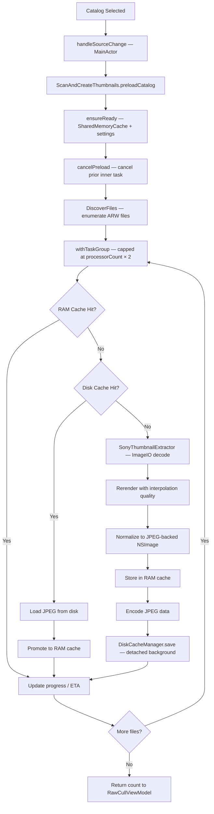
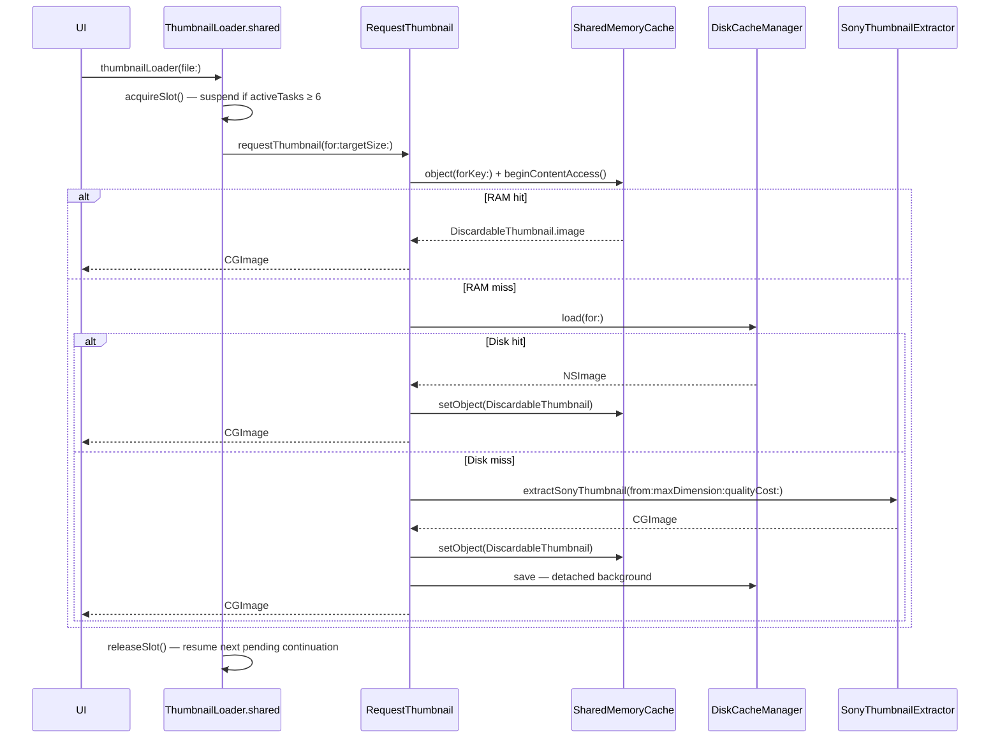
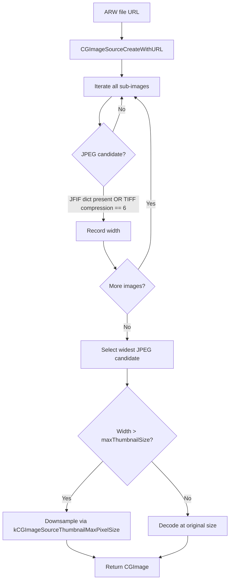

+++
author = "Thomas Evensen"
title = "Thumbnails"
date = "2026-03-17"
weight = 1
tags = ["thumbnails", "ARW", "extraction"]
categories = ["technical details"]
mermaid = true
+++

# Thumbnails and Previews — RawCull

RawCull handles Sony ARW files through two distinct image paths:

1. **Generated thumbnails** — fast, sized-down previews for browsing and culling, extracted with ImageIO and cached in RAM and on disk
2. **Embedded JPEG previews** — full-resolution embedded JPEGs extracted from the ARW binary for high-quality inspection and export

Both paths integrate with the shared three-layer cache system: RAM → disk → source decode.

---

## 1. Thumbnail Sizes and Settings

All thumbnail dimensions are configurable via `SettingsViewModel` and persisted to `~/Library/Application Support/RawCull/settings.json`.

| Setting | Default | Usage |
|---|---|---|
| `thumbnailSizeGrid` | 100 | Small thumbnails in grid list view |
| `thumbnailSizeGridView` | 400 | Thumbnails in the main grid view |
| `thumbnailSizePreview` | 1024 | Bulk preload target size |
| `thumbnailSizeFullSize` | 8700 | Upper bound for full-size zoom path |
| `thumbnailCostPerPixel` | 4 | RGBA bytes per pixel — drives cache cost calculation |
| `useThumbnailAsZoomPreview` | false | Reuse cached thumbnail instead of re-extracting for zoom |

All extraction uses **max pixel size on the longest edge** (`kCGImageSourceThumbnailMaxPixelSize`). Actual width and height depend on the source aspect ratio.

---

## 2. Generated Thumbnail Pipeline — `SonyThumbnailExtractor`

`SonyThumbnailExtractor` is a `nonisolated` static enum. Its `extractSonyThumbnail` method is the primary entry point for generating thumbnails from ARW files.

### 2.1 Async dispatch

To prevent blocking actor queues during CPU-intensive ImageIO work, extraction is dispatched to the global `userInitiated` GCD queue via `withCheckedThrowingContinuation`:

```swift
static func extractSonyThumbnail(
    from url: URL,
    maxDimension: CGFloat,
    qualityCost: Int = 4
) async throws -> CGImage {
    try await withCheckedThrowingContinuation { continuation in
        DispatchQueue.global(qos: .userInitiated).async {
            do {
                let image = try Self.extractSync(from: url, maxDimension: maxDimension, qualityCost: qualityCost)
                continuation.resume(returning: image)
            } catch {
                continuation.resume(throwing: error)
            }
        }
    }
}
```

### 2.2 ImageIO extraction (`extractSync`)

`extractSync` is `nonisolated` and runs synchronously on the GCD thread:

```swift
let sourceOptions: [CFString: Any] = [kCGImageSourceShouldCache: false]
guard let source = CGImageSourceCreateWithURL(url as CFURL, sourceOptions as CFDictionary) else {
    throw ThumbnailError.invalidSource
}

let thumbOptions: [CFString: Any] = [
    kCGImageSourceCreateThumbnailFromImageAlways: true,
    kCGImageSourceCreateThumbnailWithTransform:   true,
    kCGImageSourceThumbnailMaxPixelSize:          maxDimension,
    kCGImageSourceShouldCacheImmediately:         true
]

guard let cgImage = CGImageSourceCreateThumbnailAtIndex(source, 0, thumbOptions as CFDictionary) else {
    throw ThumbnailError.generationFailed
}
return try rerender(cgImage, qualityCost: qualityCost)
```

`kCGImageSourceShouldCache: false` on the source prevents ImageIO from caching the raw input; `kCGImageSourceShouldCacheImmediately: true` on the thumbnail options ensures the decoded output pixels are available immediately.

### 2.3 Re-rendering with interpolation quality (`rerender`)

After ImageIO decodes the thumbnail, `rerender` redraws it into a new `CGContext`. This applies controlled interpolation quality and normalizes the pixel format to `sRGB premultipliedLast`:

```swift
private static nonisolated func rerender(_ image: CGImage, qualityCost: Int) throws -> CGImage {
    let quality: CGInterpolationQuality = switch qualityCost {
        case 1...2: .low
        case 3...4: .medium
        default:    .high
    }
    guard let colorSpace = CGColorSpace(name: CGColorSpace.sRGB),
          let ctx = CGContext(
              data: nil,
              width: image.width,
              height: image.height,
              bitsPerComponent: 8,
              bytesPerRow: 0,
              space: colorSpace,
              bitmapInfo: CGImageAlphaInfo.premultipliedLast.rawValue
          ) else {
        throw ThumbnailError.contextCreationFailed
    }
    ctx.interpolationQuality = quality
    ctx.draw(image, in: CGRect(x: 0, y: 0, width: image.width, height: image.height))
    guard let rendered = ctx.makeImage() else {
        throw ThumbnailError.generationFailed
    }
    return rendered
}
```

**Interpolation quality mapping**:

| `thumbnailCostPerPixel` | `CGInterpolationQuality` |
|---|---|
| 1–2 | `.low` — fastest, lowest quality |
| 3–4 | `.medium` — balanced (default) |
| 5+ | `.high` — best quality, highest CPU |

---

## 3. Thumbnail Storage Format

The RAM cache and disk cache use different representations of the same image.

**RAM cache** stores an `NSImage` created directly from the decoded `CGImage`:

```swift
let image = NSImage(cgImage: cgImage, size: NSSize(width: cgImage.width, height: cgImage.height))
```

This wraps the existing pixel buffer without any re-encoding, keeping the store path fast. The `NSImage` is then wrapped in a `DiscardableThumbnail` that computes its `NSCache` cost from pixel dimensions and `thumbnailCostPerPixel`:

```swift
private func storeInMemoryCache(_ image: NSImage, for url: URL) {
    guard SharedMemoryCache.shared.object(forKey: url as NSURL) == nil else { return }
    let wrapper = DiscardableThumbnail(image: image, costPerPixel: getCostPerPixel())
    SharedMemoryCache.shared.setObject(wrapper, forKey: url as NSURL, cost: wrapper.cost)
}
```

**Disk cache** encodes the same `CGImage` to JPEG (quality 0.7) while it is still in scope on the actor, then hands a plain `Data` value to a detached background task for writing. `Data` is `Sendable`; `CGImage` is not, so the encode must happen before crossing the task boundary:

```swift
guard let jpegData = DiskCacheManager.jpegData(from: cgImage) else { return }
let dcache = diskCache
Task.detached(priority: .background) {
    await dcache.save(jpegData, for: url)
}
```

The disk write never blocks the extraction pipeline.

---

## 4. Preload Flow (Bulk) — `ScanAndCreateThumbnails`

When the user selects a catalog, `RawCullViewModel.handleSourceChange(url:)` triggers bulk preloading.

### 4.1 Concurrency model

`preloadCatalog(at:targetSize:)` begins by delegating directory enumeration to `DiscoverFiles`, then notifies the UI of the total file count before the task group starts:

```swift
let urls = await DiscoverFiles().discoverFiles(at: catalogURL, recursive: false)
totalFilesToProcess = urls.count
await fileHandlers?.maxfilesHandler(urls.count)
```

The task group is then bounded to `ProcessInfo.processInfo.activeProcessorCount * 2` concurrent tasks. Back-pressure is applied with `await group.next()` before adding a new task when the limit is reached.

### 4.2 Per-file processing

For each ARW file, `processSingleFile(_:targetSize:itemIndex:)` runs the three-tier cache lookup:

```
RAM cache → Disk cache → SonyThumbnailExtractor
```

Cancellation is checked with `Task.isCancelled` before and after every expensive operation. If cancelled mid-extraction, the result is discarded and no write occurs.

### 4.3 Caching after extraction

On a successful source extraction the `costPerPixel` is fetched once from `SharedMemoryCache` (async, so the actor releases during the await), then the thumbnail is stored and the disk write is queued:

1. `NSImage(cgImage:size:)` wraps the decoded pixels without re-encoding.
2. `storeInMemoryCache(_:for:)` creates a `DiscardableThumbnail` using the cached `costPerPixel` and stores it in `SharedMemoryCache`.
3. `DiskCacheManager.jpegData(from:)` encodes to JPEG (quality 0.7) on the actor while the `CGImage` is still in scope — `CGImage` is not `Sendable` and cannot be passed across the task boundary.
4. `diskCache.save(_:for:)` writes the JPEG `Data` from a `Task.detached(priority: .background)` — the extraction pipeline does not wait for this write.

### 4.4 Progress and ETA

After each file completes, the UI is notified via a fire-and-forget `Task { @MainActor in }` so the pipeline never suspends waiting for SwiftUI to render:

```swift
private func notifyFileHandler(_ count: Int) {
    let handler = fileHandlers?.fileHandler
    Task { @MainActor in handler?(count) }
}
```

ETA is computed from the **inter-arrival time** between consecutive completions rather than each task's own wall-clock duration. This naturally reflects the real throughput of the bounded task group regardless of how individual file processing times vary:

```swift
if let lastTime = lastItemTime {
    processingTimes.append(now.timeIntervalSince(lastTime))
}
lastItemTime = now

let recentTimes = processingTimes.suffix(min(10, processingTimes.count))
let avgTimePerItem = recentTimes.reduce(0, +) / Double(recentTimes.count)
let estimatedSeconds = Int(avgTimePerItem * Double(totalFilesToProcess - itemsProcessed))
```

The rolling window averages only the last 10 inter-arrival samples, so the estimate adapts quickly as cache-hit rates shift (e.g. early RAM misses giving way to disk hits). Estimation is suppressed until at least 10 items have completed (`minimumSamplesBeforeEstimation`) to avoid noisy early values during cold-start I/O.

### 4.5 Request coalescing

If `thumbnail(for:targetSize:)` is called concurrently for the same URL while extraction is in progress, an `inflightTasks: [URL: Task<CGImage, Error>]` dictionary provides coalescing. Subsequent callers `await` the existing task rather than launching duplicate extraction work.

---

## 5. On-Demand Thumbnails — `ThumbnailLoader` + `RequestThumbnail`

UI elements (grid view, file list, inspector) request thumbnails through the on-demand path.

### 5.1 ThumbnailLoader (rate limiting)

`ThumbnailLoader.shared` is a global actor singleton that caps concurrent thumbnail loads at 6. Requests beyond this limit suspend via `CheckedContinuation` and queue in `pendingContinuations`. When a slot is released, the next waiting continuation is resumed. The target size passed to `RequestThumbnail` is `thumbnailSizePreview` (default 1024).

If a waiting task is cancelled before its slot becomes available, its continuation is removed from the queue by UUID so it is never spuriously resumed.

### 5.2 RequestThumbnail (cache pipeline)

`RequestThumbnail` handles the actual per-file resolution for the on-demand path:

1. `ensureReady()` — `setupTask` gate ensures `SharedMemoryCache` is configured once.
2. RAM cache lookup via `SharedMemoryCache.object(forKey:)` + `beginContentAccess()`.
3. Disk cache lookup via `DiskCacheManager.load(for:)`.
4. Extraction fallback via `SonyThumbnailExtractor.extractSonyThumbnail(from:maxDimension:qualityCost:)`.
5. Store in RAM cache.
6. Disk save via a detached background task.

`requestThumbnail(for:targetSize:)` returns `CGImage?` for direct use by SwiftUI views.

---

## 6. Embedded JPEG Preview Extraction — `JPGSonyARWExtractor`

Embedded JPEG previews are distinct from generated thumbnails. They are the full-resolution previews baked into the ARW file by the camera, and are used for high-quality inspection and export.

`JPGSonyARWExtractor` is a `nonisolated` static enum dispatched to `DispatchQueue.global(qos: .utility)`.

### 6.1 JPEG detection algorithm

ARW files contain multiple image sub-images. The extractor iterates all of them and identifies JPEG candidates by:

1. Presence of `kCGImagePropertyJFIFDictionary` in image properties, **or**
2. Compression value `6` (JPEG) in the `kCGImagePropertyTIFFDictionary`.

Among all JPEG candidates, the **widest image** is selected. Width is read from `kCGImagePropertyPixelWidth`, falling back to the TIFF or EXIF width dictionary entries.

### 6.2 Downsampling large previews

```swift
let maxThumbnailSize: CGFloat = fullSize ? 8640 : 4320
```

If the selected JPEG's width exceeds `maxThumbnailSize`, it is downsampled using ImageIO:

```swift
let thumbOptions: [CFString: Any] = [
    kCGImageSourceCreateThumbnailFromImageAlways: true,
    kCGImageSourceCreateThumbnailWithTransform:   true,
    kCGImageSourceThumbnailMaxPixelSize:          Int(maxThumbnailSize)
]
CGImageSourceCreateThumbnailAtIndex(source, index, thumbOptions as CFDictionary)
```

If the JPEG is already smaller than `maxThumbnailSize`, it is decoded at its original size with `CGImageSourceCreateImageAtIndex`.

---

## 7. JPEG Export — `SaveJPGImage`

`SaveJPGImage.save(image:originalURL:)` writes an extracted `CGImage` alongside the original ARW:

- **Output path**: `originalURL` with `.arw` extension replaced by `.jpg`
- **Compression quality**: `1.0` (maximum, no lossy compression)
- **Format**: JPEG via `CGImageDestinationCreateWithURL` + `CGImageDestinationFinalize`

The method is `nonisolated` and runs on the global queue via `async`, keeping actor queues clear of blocking I/O.

---

## 8. Error Handling

`ThumbnailError` defines three typed errors for the thumbnail pipeline:

```swift
enum ThumbnailError: Error, LocalizedError {
    case invalidSource          // CGImageSourceCreateWithURL returned nil
    case generationFailed       // CGImageSourceCreateThumbnailAtIndex or CGContext.makeImage returned nil
    case contextCreationFailed  // CGContext creation failed
}
```

All callers catch errors, log the failure with file path and description, and return `nil` to the consumer. A single corrupt or unreadable file does not interrupt bulk processing — the preload loop and extraction loop both continue with the next file.

---

## 9. Flow Diagrams

### 9.1 Bulk Preload (ScanAndCreateThumbnails)



### 9.2 On-Demand Request (ThumbnailLoader + RequestThumbnail)



### 9.3 Embedded JPEG Extraction (JPGSonyARWExtractor)



---

## 10. Settings Reference

| Setting | Default | Effect |
|---|---|---|
| `memoryCacheSizeMB` | 5000 | Sets `NSCache.totalCostLimit` |
| `thumbnailCostPerPixel` | 4 | Drives `DiscardableThumbnail` cost and interpolation quality |
| `thumbnailSizePreview` | 1024 | Bulk preload target size |
| `thumbnailSizeGrid` | 100 | Grid list thumbnail size |
| `thumbnailSizeGridView` | 400 | Main grid view thumbnail size |
| `thumbnailSizeFullSize` | 8700 | Full-size zoom path upper bound |
| `useThumbnailAsZoomPreview` | false | Skip re-extraction and use cached thumbnail for zoom |
