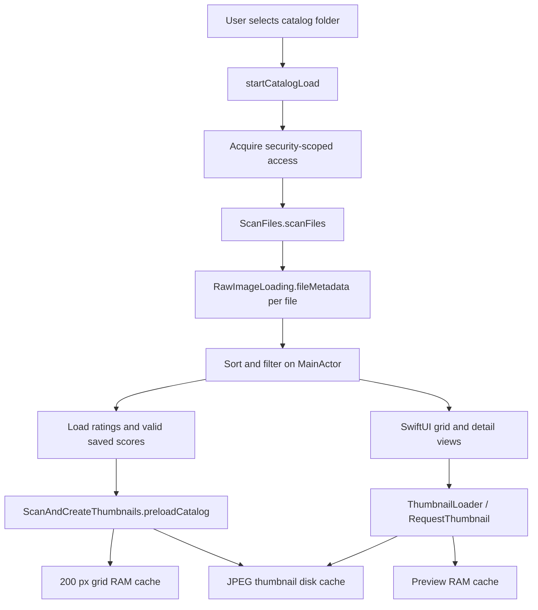
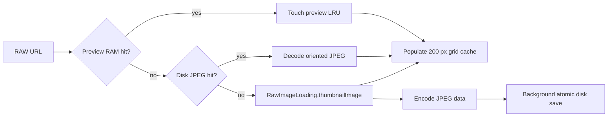
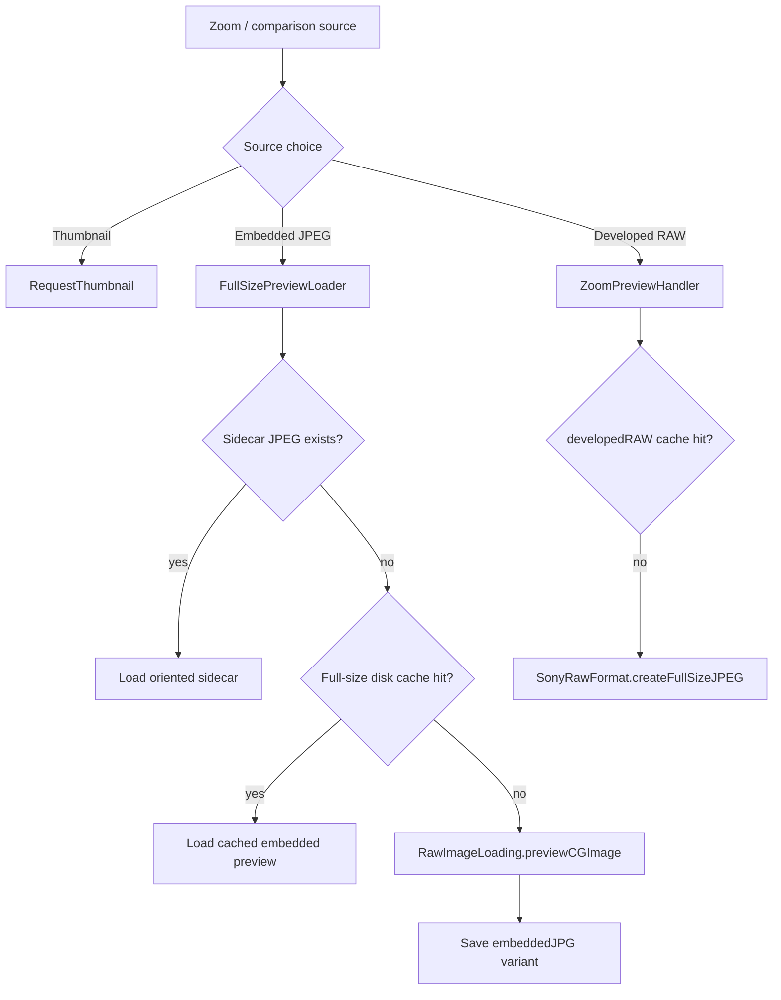

+++
author = "Thomas Evensen"
title = "Thumbnails and Scan Pipeline"
date = "2026-07-15"
weight = 10
tags = ["thumbnails", "scan", "ARW", "NEF", "extraction"]
categories = ["technical details"]
mermaid = true
+++

# Thumbnails and Scan Pipeline

RawCull separates catalog scanning, thumbnail preloading, UI-driven thumbnail requests, and full-size preview extraction. They share RawParserKit and disk-cache infrastructure, but they have deliberately different memory-admission rules.

The key current invariant is: **catalog preloading warms the 200 px grid cache and disk cache, but only UI demand may admit an image to the preview-size RAM cache**. This keeps scan order from displacing the images the user is actively viewing.

## Source Map

| Area | Main files |
|---|---|
| Catalog lifecycle | `RawCullViewModel+Catalog.swift`, `RawCullMainView.swift` |
| App/package loading boundary | `Model/RawImageLoading.swift`, `RawParserKit/Sources/RawParserKit/RawImageLoader.swift` |
| File discovery and metadata scan | `Actors/DiscoverFiles.swift`, `Actors/ScanFiles.swift` |
| Catalog thumbnail preload | `Actors/ScanAndCreateThumbnails.swift`, `Model/Handlers/CreateFileHandlers.swift` |
| UI-driven thumbnails | `Actors/ThumbnailLoader.swift`, `Actors/RequestThumbnail.swift`, `ThumbnailImageView.swift` |
| Thumbnail caches | `Actors/SharedMemoryCache.swift`, `Actors/DiskCacheManager.swift`, `Model/Cache/CachedThumbnail.swift` |
| Full-size preview loading | `Model/FullSizePreviewLoader.swift`, `Model/Handlers/ZoomPreviewHandler.swift`, `Actors/FullSizeJPGDiskCache.swift` |
| Vendor dispatch | `RawParserKit/Sources/RawParserKit/RawFormat.swift`, `RawFormatRegistry.swift`, `SonyRawFormat.swift`, `NikonRawFormat.swift` |
| Concurrency tests | `RawCullTests/ThumbnailLoaderConcurrencyTests.swift`, `ThumbnailProviderTests.swift`, `DiskCacheAndScanAdmissionTests.swift` |

## Catalog Load Flow


```mermaid
flowchart TD
    A["User selects catalog folder"] --> B["startCatalogLoad"]
    B --> C["Acquire security-scoped access"]
    C --> D["ScanFiles.scanFiles"]
    D --> E["RawImageLoading.fileMetadata per file"]
    E --> F["Sort and filter on MainActor"]
    F --> G["Load ratings and valid saved scores"]
    G --> H["ScanAndCreateThumbnails.preloadCatalog"]
    H --> I["200 px grid RAM cache"]
    H --> J["JPEG thumbnail disk cache"]
    F --> K["SwiftUI grid and detail views"]
    K --> L["ThumbnailLoader / RequestThumbnail"]
    L --> M["Preview RAM cache"]
    L --> J
```

## Catalog Load Ownership

`RawCullViewModel.startCatalogLoad(for:)` cancels the older load, starts security-scoped access, and creates a background-priority `catalogLoadTask` that runs `handleSourceChange(url:)`.

`handleSourceChange(url:)` is main-actor orchestration. File I/O, metadata work, decoding, and cache I/O are awaited through actors or detached work. After every significant suspension, `isActiveCatalogLoad(_:)` and cancellation checks prevent an old catalog from publishing into the current UI.

Changing catalogs also cancels thumbnail/full-preview work, clears burst analysis state, stops the old security scope, and releases the current scanning actors.

## File Discovery

`DiscoverFiles` enumerates a directory off the main actor and filters extensions through `RawFormatRegistry.allExtensions`. Its `recursive` parameter controls whether subdirectories are traversed.

The current registry contains:

| Format | Extension | Conformer |
|---|---|---|
| Sony ARW | `.arw` | `SonyRawFormat` |
| Nikon NEF | `.nef` | `NikonRawFormat` |

`ScanFiles` performs its own non-recursive directory listing and asks `RawFormatRegistry.format(for:)` whether each item is supported. Discovery and scan therefore share registry policy rather than maintaining separate hard-coded extension lists.

## Metadata Scan

`ScanFiles.scanFiles(url:onProgress:)` starts its own security-scoped access and creates one child task per supported file. Each child:

1. reads URL resource values for name, byte size, content type, and modification date;
2. calls the injected `RawImageLoading.fileMetadata(for:)` abstraction;
3. builds a `FileItem` with EXIF metadata and the normalized AF point;
4. records the package focus-location string when available.

The production adapter, `RawParserKitImageLoader`, maps `RawParserKit.RawImageLoader.metadata(for:)` into the app's `ExifMetadata`. RawParserKit reads ImageIO EXIF/TIFF data, dispatches body-specific details through `RawFormatRegistry`, and resolves MakerNote or EXIF subject-area focus evidence.

This is a single metadata pass per file. The app no longer runs separate EXIF and MakerNote extraction passes.

If **no** native focus-location strings are found for the catalog, `ScanFiles` falls back to `focuspoints.json`. This is catalog-wide fallback behavior; it does not merge JSON entries into a partly populated native result.

`FileItem` is an app typealias for `RawCullCore.RawCullFileItem`, keeping scan output usable by the pure package engines and tests.

## Thumbnail Preload

After scan, sort, ratings, and valid saved scores are applied, `ScanAndCreateThumbnails.preloadCatalog(at:targetSize:)` walks the catalog again to warm browsing caches. A catalog URL already recorded in `processedURLs` is not preloaded again during the same app session.

The outer task group admits at most:

```text
RawImageLoadingConcurrency.batchExtractionLimit
= max(1, activeProcessorCount * 2)
```

RawParserKit adds an internal six-slot thumbnail decode limiter and coalesces identical URL/size requests. The outer limit bounds catalog work; the package limit prevents simultaneous RAW decodes from growing without bound.

For each file, preload uses this path:


```mermaid
flowchart LR
    A["RAW URL"] --> B{"Preview RAM hit?"}
    B -->|"yes"| C["Touch preview LRU"]
    B -->|"no"| D{"Disk JPEG hit?"}
    D -->|"yes"| E["Decode oriented JPEG"]
    D -->|"no"| F["RawImageLoading.thumbnailImage"]
    C --> G["Populate 200 px grid cache"]
    E --> G
    F --> G
    F --> H["Encode JPEG data"]
    H --> I["Background atomic disk save"]
```

All three branches populate the dedicated grid cache when needed. Disk and source branches **do not** insert into the preview-size RAM cache. `RequestThumbnail` is its only admitter, so preview LRU ordering reflects user demand instead of scan order.

On a cold extraction, `ScanAndCreateThumbnails` converts the actor-owned image to JPEG `Data` before launching the background disk save. This avoids sending `CGImage` or `NSImage` across the detached-task boundary.

## The Two Memory Caches

`SharedMemoryCache` owns two `NSCache` instances:

| Cache | Content | Admission policy |
|---|---|---|
| Preview cache (`memoryCache`) | Preview-size images used for detail/list demand | Only `RequestThumbnail` inserts; a hit touches its LRU position |
| Grid cache (`gridThumbnailCache`) | Downscaled 200 px images | Preload populates it; grid requests can return immediately |

Both caches are cost-limited. The preview item count limit is intentionally high so byte cost is the normal binding constraint. Under warning memory pressure both limits shrink to 60%; under critical pressure both caches are cleared and the preview cache is temporarily capped at 50 MiB.

## UI-Driven Thumbnail Loading

`ThumbnailImageView` has two routes:

- `.grid` calls the shared `ThumbnailLoader` actor;
- `.list` calls `RequestThumbnail` directly.

For grid targets of 200 px or less, `ThumbnailLoader` first checks the grid cache without acquiring a concurrency slot. A miss joins its FIFO-like slot queue, which allows at most six active requests and removes cancelled waiters safely.

After a slot is acquired, the loader reads saved settings and asks `RequestThumbnail` for `settings.thumbnailSizePreview`. The passed grid target controls the grid-cache fast path; the slower preview request uses the configured preview size.

`RequestThumbnail` resolves a request in this order:

1. preview RAM cache;
2. oriented JPEG disk cache;
3. `RawImageLoading.thumbnailCGImage` source decode.

A disk hit is promoted into preview RAM. A cold source decode is inserted into preview RAM and asynchronously encoded to the thumbnail disk cache. The cache also records UI demand, cold extraction, eviction, and “boomerang” diagnostics for measuring whether a recently evicted image had to be reloaded from disk.

## Disk Thumbnail Cache

`DiskCacheManager` stores quality-0.7 JPEGs. Its key is an MD5 filename hash of a version string plus the standardized source path. MD5 is used only as a compact filesystem key, not for security.

The current key version includes oriented-thumbnail semantics, so thumbnails from older orientation behavior are automatically invalidated. Loads use `OrientationNormalizedImageLoader`, and writes are atomic.

## Full-Size And Zoom Preview Paths

Full-size inspection does not use the normal thumbnail disk cache.


```mermaid
flowchart TD
    A["Zoom / comparison source"] --> B{"Source choice"}
    B -->|"Thumbnail"| C["RequestThumbnail"]
    B -->|"Embedded JPEG"| D["FullSizePreviewLoader"]
    B -->|"Developed RAW"| E["ZoomPreviewHandler"]
    D --> F{"Sidecar JPEG exists?"}
    F -->|"yes"| G["Load oriented sidecar"]
    F -->|"no"| H{"Full-size disk cache hit?"}
    H -->|"yes"| I["Load cached embedded preview"]
    H -->|"no"| J["RawImageLoading.previewCGImage"]
    J --> K["Save embeddedJPG variant"]
    E --> L{"developedRAW cache hit?"}
    L -->|"no"| M["SonyRawFormat.createFullSizeJPEG"]
```

`FullSizePreviewLoader` prefers a same-basename `.jpg` sidecar, then the full-size disk cache, then RawParserKit extraction. RawParserKit itself coalesces duplicate preview requests and limits expensive full-size decode work to two concurrent operations.

The developed-RAW route is currently Sony-specific and uses its own cache variant. The full-size cache stores quality-0.85 JPEG data and has a versioned orientation-aware key. Keeping these larger images on disk prevents a few pixel-peeping previews from evicting many browsing thumbnails from RAM.

## App Loading Abstraction

The app depends on the `RawImageLoading` protocol rather than calling vendor conformers directly:

| Requirement | Use |
|---|---|
| `fileMetadata` / `exifMetadata` | Scan metadata and normalized focus evidence |
| `thumbnailCGImage` / `thumbnailImage` | On-demand and preload thumbnail generation |
| `previewCGImage` | Embedded/sidecar full-size preview loading |

`RawParserKitImageLoader` is the production adapter. Tests can inject alternate loaders without performing real RAW decoding.

Within RawParserKit, `RawFormat` provides vendor policy:

| Requirement | Use |
|---|---|
| `extensions`, `displayName` | Registry lookup and diagnostics |
| `extractThumbnail` | Vendor thumbnail fallback |
| `extractEmbeddedPreview` | Largest usable embedded preview |
| `focusLocation` | MakerNote AF location |
| `rawFileTypeString` | Compression labels |
| `sizeClassThresholds`, `rawSizeClass` | Body-specific S/M/L size labels |

`extractFullJPEG` remains only as a deprecated compatibility requirement; new code uses `extractEmbeddedPreview`.

## What To Check When Changing This Area

- Preserve the rule that scan/preload does not admit disk or source results to preview RAM.
- Check both the grid-cache fast path and configured preview-size path when changing thumbnail settings.
- Keep `RawFormatRegistry.allExtensions` and `RawFormatRegistry.all` aligned when adding a format.
- Keep expensive decode limits and cancellation behavior covered by concurrency tests.
- Convert actor-owned images to `Data` before detached cache writes.
- Version cache keys when orientation or encoded-image semantics change.
- Inspect `isActiveCatalogLoad(_:)` guards if stale results appear after switching folders.
